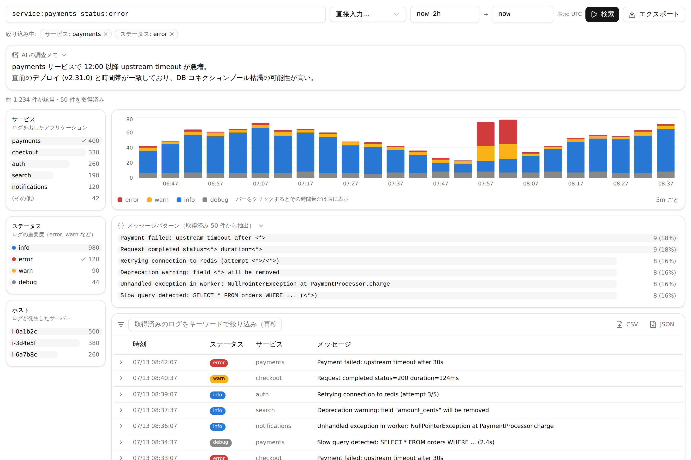
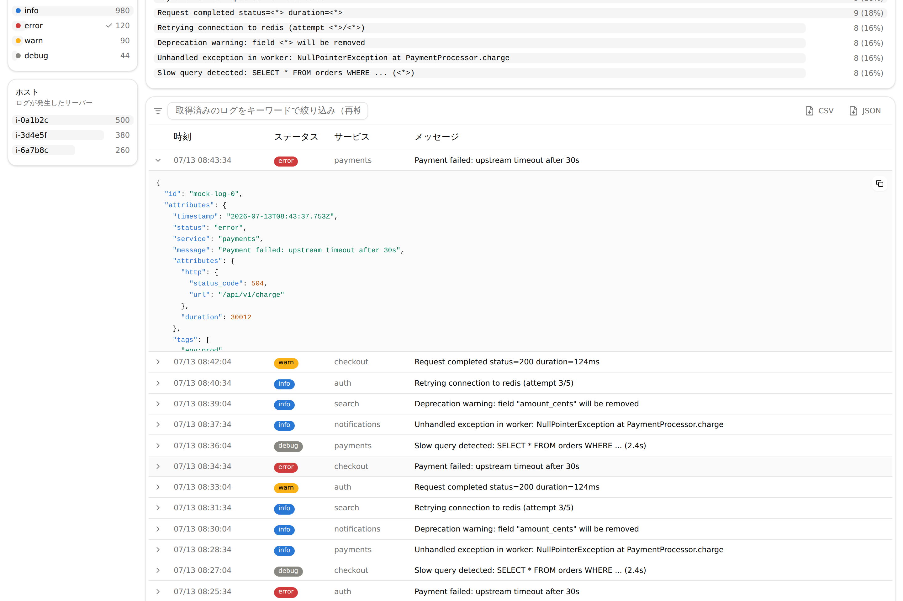

# mcp-datadog-logs

Datadog と MCP Apps 周辺のサンプル/ツールをまとめた monorepo です。

主な内容は次の2つです。

- Datadog Logs を調査する MCP サーバー
- ローカル PC のメトリクスとログを Datadog に送る Node.js サンプル

## パッケージ

| Package | Path | 用途 |
|---|---|---|
| `@kajidog/mcp-datadog-logs` | `apps/mcp-datadog-logs` | Datadog Logs を MCP から検索/集計/可視化する公開 npm package |
| `@kajidog/datadog-pc-telemetry-sample` | `apps/datadog-pc-telemetry-sample` | ローカル PC のメトリクスとログを Datadog に送るサンプル |
| `@kajidog/investigator-ui` | `packages/investigator-ui` | MCP Apps 用 UI。サーバーに単一 HTML として同梱 |
| `@kajidog/investigation-shared` | `packages/shared` | UI と MCP サーバー間で共有する型 |

## Datadog PC Telemetry Sample

ローカル PC から Datadog に次のデータを送る最小サンプルです。

- `v2.MetricsApi.submitMetrics` によるカスタムメトリクス送信
- `v2.LogsApi.submitLog` によるログ送信
- CPU 使用率、メモリ使用量、load average、uptime、Node.js process memory などの収集

実行方法:

```bash
cd apps/datadog-pc-telemetry-sample
cp .env.example .env
```

`.env` に Datadog の API key と site を設定します。Japan site の場合は `ap1.datadoghq.com` です。

```dotenv
DD_API_KEY=your-datadog-api-key
DD_SITE=ap1.datadoghq.com
DD_ENV=dev
DD_SERVICE=datadog-pc-telemetry-sample
```

送信せずに payload を確認:

```bash
npm run dry-run
```

Datadog に1回送信:

```bash
npm run dev
```

10秒ごとに60回送信:

```bash
npm run dev -- --samples=60 --interval=10
```

詳細は [apps/datadog-pc-telemetry-sample/README.md](./apps/datadog-pc-telemetry-sample/README.md) を見てください。

## MCP Datadog Logs

Datadog Logs を MCP クライアントから調査するためのサーバーです。

MCP Apps 対応クライアントでは、タイムライン・ファセット・メッセージパターン付きの調査画面が開きます（スクリーンショットはモックデータ）。



ログ行をクリックすると raw ログの JSON 詳細を展開できます。



できること:

- **ログ検索・集計** — モデル向けのコンパクトなテキスト出力。ファセット別カウントや、`interval` 指定でファセット別の時系列集計
- **ヘッドレス調査** — 調査結果（ログ行・タイムライン・ファセット）はサーバー側セッションに保持し、モデルには要約と `viewUUID` だけを返すのでコンテキストを圧迫しない
- **MCP Apps UI での調査画面** — タイムラインチャート、ファセットサイドバー、メッセージパターンパネル、ログテーブル（クリックで絞り込み、UI からクエリ・期間を変えて再実行）
- **メッセージパターン分析** — ログメッセージをテンプレート（`Payment failed for order <*>`）に自動クラスタリングし、要約・UI・レポートに表示
- **エクスポート** — 自己完結の HTML レポート、または絞り込み済みログ行の CSV / JSON 出力
- **セッション永続化** — 調査セッションをローカルにキャッシュし、サーバー再起動後も `viewUUID` を引き続き利用可能

調査で使う `findings` は Markdown として UI と HTML レポートに描画されます。また `from`/`to` に絶対時刻を渡す場合はタイムゾーン付き ISO 8601（`Z` や `+09:00`）が必須です。

公開 package:

```bash
npx -y @kajidog/mcp-datadog-logs
```

必要な環境変数:

- `DD_API_KEY`
- `DD_APP_KEY`
- `DD_SITE`

Japan site の場合、MCP 側も必ず `DD_SITE=ap1.datadoghq.com` を指定してください。`DD_SITE` を省略すると `datadoghq.com` に送るため、AP1 の key では 401 になります。

詳細は [apps/mcp-datadog-logs/README.md](./apps/mcp-datadog-logs/README.md) を見てください。

Datadog Application Key に必要な権限は [docs/datadog-permissions.md](./docs/datadog-permissions.md) にまとめています。

## 開発

```bash
pnpm install
pnpm build
pnpm test
pnpm lint
```

個別パッケージの実行例:

```bash
pnpm -C apps/datadog-pc-telemetry-sample dry-run
pnpm -C apps/datadog-pc-telemetry-sample dev
pnpm --filter @kajidog/investigator-ui dev
DD_API_KEY=... DD_APP_KEY=... pnpm --filter @kajidog/mcp-datadog-logs dev
```

## MCP Inspector でのスモークテスト

```bash
pnpm build
DD_SITE=ap1.datadoghq.com DD_API_KEY=... DD_APP_KEY=... npx @modelcontextprotocol/inspector node apps/mcp-datadog-logs/dist/index.js
```

## リリース

`@kajidog/mcp-datadog-logs` の公開は changesets で管理しています。

```bash
pnpm changeset
```

`main` に merge すると Release workflow が version PR を作成し、その PR を merge すると npm に publish されます。publish には repository secret の `NPM_TOKEN` が必要です。

version PR を merge するときは、server package の `src/version.ts` と `package.json` の version が揃っていることを確認してください。
